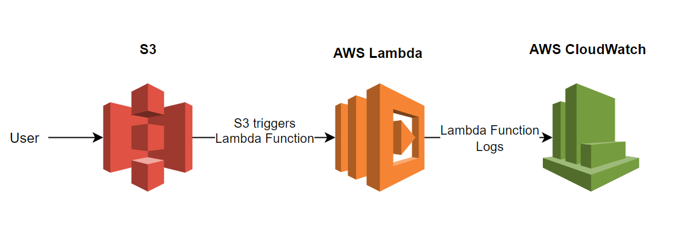
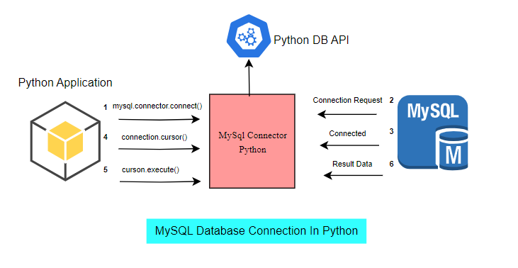
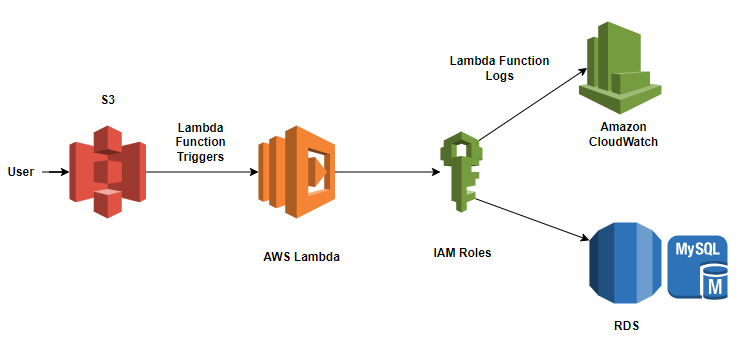
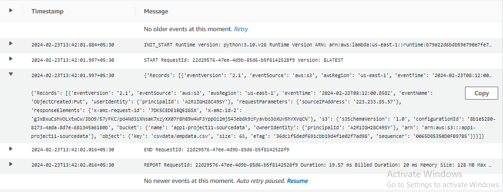
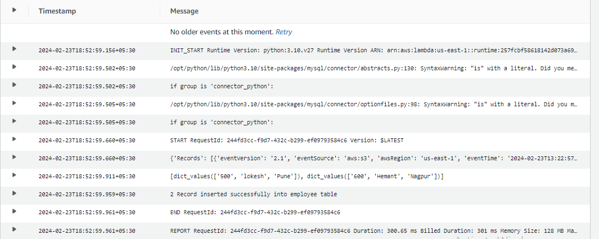

# Load DATA from AWS S3 to AWS RDS MySql server databases using AWS Lambda function with AWS Lambda Layers

## Architecture

<p align="center">
  
  </p>


<p align="center">
  
  </p>


<p align="center">
  
  </p>


Setting up Lambda with below Roles
1. RDS Role
2. S3 Role
3. Cloud Watch Role
Creating the Lambda Function - Adding Code 
Creating the Lambda Function - Adding the Trigger 
Checking Cloud Watch


# Stages of DATA Transformation using Lambda and python.

## Stage-1: Understand the requirements of Project

## Stage-2: Creating csv file using python (Write and Read)
1. To userstand How to read and write csv file using python so it will be easier to write Lambda function for project.
2. Writing CSV files with csv: you can write to csv file using writer object and .write_row() method. for that....Create 'writeEmployeeDataToCsv.py' and add some entries as given. employee.csv file will be create after execution of code.
3. Writing CSV file from a Dictionary with csv. for that ... create 'writeEmployeeDataToCsvUsingDict.py' and refer the code given in the repo. 'empdata.csv' will be created after execution of code.
4. Reading CSV files which is going to be used in Lambda function. So create 'readCsvFile.py' refer the code and here we will read data from 'empdata.csv' which was created in 3rd step. 


## Stage-3: Create Basic Lambda function, IAM Roles, CloudWatch
1. Create S3 bucket.
2. Create IAM Role for Lambda Function to access S3 and CloudWatch. Use Only Desired permission but here im using fullaccess.
3. Create Lambda Function name: ReadDataFromAmazonS3 , Runtime: python3.10 , Execution Role: Use the role we created earlier.
4. Add Trigger ==> S3, bucket name, event type, prefix and suffix. Here i used prefix as csvdata/ and sufix .csv
5. In default lambda code add "print(event)" and upload empdata.csv in S3 and check the logs.
6. You will see the json format event data of csv file. Use json formatter for easy reading. Later this Keywords required for Lambda function code.
7. Write Lambda Function and Execute


**lambda-1-readCsvData.py**

```py
import json
import boto3
import csv
s3_client = boto3.client('s3')
def lambda_handler(event,context):
    print(event)
    bucket = event['Records'][0]['s3']['bucket']['name']
    csv_file = event['Records'][0]['s3']['object']['key']
    csv_file_obj = s3_client.get_object(Bucket=bucket, Key=csv_file)
    lines = csv_file_obj['Body'].read().decode('utf-8').split()
    results = []
    for row in csv.DictReader(lines):
        results.append(row.values())
    print(results)
    return {
        'statusCode': 200,
        'body': json.dumps('Hello from Lambda!')
    }

```

<p align="center">
  
  </p>


## Stage-4: Create, Connect and Interact with RDS using SQL Workbench & python
1. Create RDS MySQL Database: Easy Create ==> MySQL ==> free tier ==> DBInstance Name: lambda ==> Username: admin ==> Password: Lambda#2024 ==> CreateDatabase.
2. Update Security group and add your IP for access or provide all just for learning purpose.  Modify DB Instance => allow public access. Access Database using workbench or CMD.
```cmd
mysql -h <hostname> -P <port default is 3306> -u <username> -p<password>
```
```sql
CREATE DATABASE employeedb;
-- Use any name but remember to update in code
USE employeedb;
-- Use any name but remember to update in code
CREATE TABLE employee(empid int PRIMARY KEY, empname varchar(40), empaddress varchar(40));
-- Use any dictionary but remember to update in code
SELECT * FROM employee;
```
3. Install mysql-connector in local machine.
```cmd
pip install mysql-connector
```
4. Create python script to Insert data into Mysql. 'insertDataIntoMysql.py' refer script available in repo and execute. If no Error You will be able to see data in MySQL database.

## Stage-5: AWS Lambda Layers for Python and Connect RDS using Lambda
1. Update previous Role and add RDS access.
2. Create Lambda Function 'ConnectToRDSUsingPython' and existing execution role.
3. Create Layers. In Lambda mysql.connector is not available. In local machine create directory structure in following way.
```cmd
mkdir -p aws-lambda-layer-python/build/python/lib/python3.10/site-packages
pip install mysql-connector -t aws-lambda-layer-python/build/python/lib/python3.10/site-packages
#create zip file of python folder manually or through cli.
zip -r python.zip python
```
4. Upload zip file in the layers and write lambda function. 'Connect_To_RDS_Using_python.py' available in repo and execute the code.
5. As we know we had 2 entries in database which we added using local python code. Now we can see 2 more different entries in code.

## Stage-6: Read S3 CSV file and insert into RDS mysql using Python Lambda Function
1. Update 'ReadDataFromAmazonS3' Lambda Function. Add mysql-connector layer and update code with the help of 'ConnectToRDSUsingPython'. Refer 'ReadDataFromS3Final.py' script for your code.
2. Update empdata.csv manually and or update entries and upload in the s3 bucket. After Uploading code lambda function will trigger and update data in the database. You can check logs for the for this lambda function.


<p align="center">
  
  </p>
